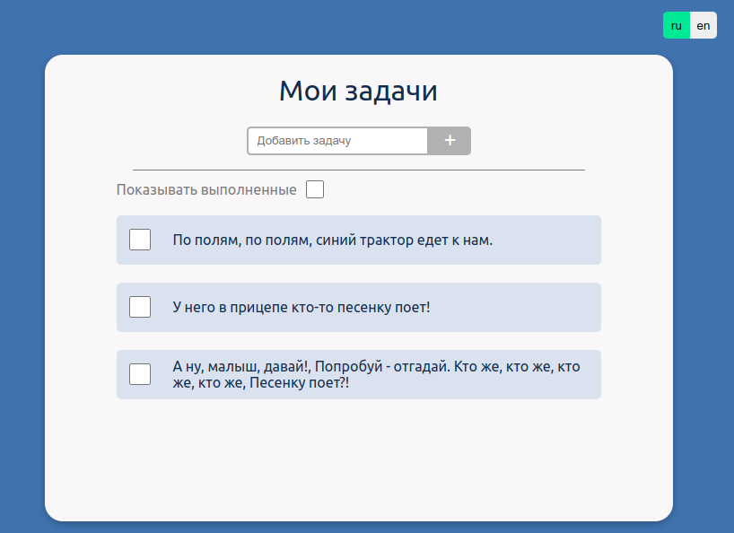

# Тестовое задание на вакансию "Frontend-разработчик"

<details><summary> Задача: </summary>
Разработать простое веб-приложение "Список задач" (Todo List) с использованием React, TypeScript, JavaScript и MobX.

### Требования:

- Создайте новый проект React с использованием TypeScript.
- Разработайте компоненты:
  - Компонент для отображения списка задач.
  - Компонент для добавления новой задачи.
  - Компонент для отметки задачи как выполненной.
  - Компонент для удаления задачи.
- Используйте MobX для управления состоянием приложения.
- Реализуйте следующую функциональность:
  - Отображение списка задач с их текущим статусом (выполнена/невыполнена).
  - Возможность добавления новой задачи.
  - Возможность отметить задачу как выполненную.
  - Возможность удалить задачу.
  - Добавьте возможность фильтрации задач по статусу (выполнена/невыполнена).
- Создайте несколько примеров задач для инициализации списка.
- Обеспечьте стилизацию и визуальное оформление приложения на своё усмотрение.
- Обеспечьте возможность редактирования задач (название, описание и т. д.) с помощью модального окна.
- Обеспечьте адаптивный дизайн приложения для поддержки различных устройств и экранов. Приложение должно выглядеть нормально и не иметь горизонтального скролла на разрешениях от 320 пикселей и выше.
- Не стесняйтесь добавлять комментарии в код.
- Обеспечьте валидацию ввода данных (например, запрет на добавление пустой задачи).
- Обеспечьте возможность переключения языков интерфейса (русский/английский) с использованием локализации.
- Используйте Git для контроля версий и предоставьте ссылку на репозиторий с выполненным заданием и коммитами.
</details>

# Решение


> Проект залит на GitHub-pages

### Локальный запуск

Для локального запуска приложения выполните следующие действия:

```
git clone https://github.com/Votchitsev/tt-todo.git
```

```
cd tt-todo
```

```
npm install
```

```
npm start
```
